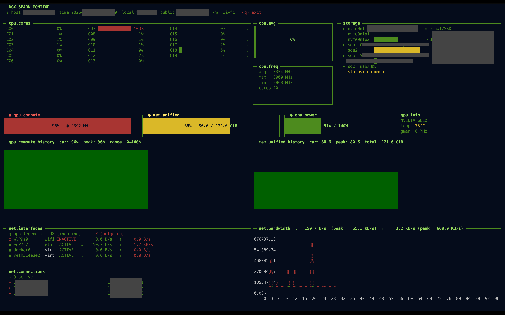

# dgx-monitor

A terminal-based real-time monitoring dashboard for NVIDIA DGX GB-10 systems with unified memory (e.g. DGX Spark). Displays CPU, GPU, memory, power, storage, and thermal metrics in a single TUI view — no external services required.



---

## Requirements

- Linux (reads `/proc/stat`, `/proc/meminfo`, `/proc/net/dev`, `/proc/mounts`, `/sys/devices/system/cpu/`, `/sys/class/net/*/`, `/sys/block/*/`)
- Go 1.21+
- NVIDIA driver with NVML support (for GPU metrics)
- A terminal at least 120 columns × 40 rows for best layout

---

## Build

```bash
make          # runs go mod tidy + build
make build    # build only
make deps     # go mod tidy only
make clean    # remove the compiled binary
```

The binary is output to `./dgx-monitor`.

---

## Run

```bash
./dgx-monitor
```

No flags or arguments — the dashboard starts immediately and refreshes every second.

**Quit:** press `q` or `Ctrl-C`.

---

## Dashboard Layout

```
┌─────────────────────────────────────────────────────────────────────┐
│ ░▒▓ DGX SPARK MONITOR ▓▒░  $ host=…  time=…  local=…  public=…  <q>│
├──────────────────────────────┬───────────┬──────────────────────────┤
│  cpu.cores  (column layout)  │ cpu.avg   │ storage                  │
│                              ├───────────┤ per-partition usage bars │
│                              │ cpu.freq  │ (internal first, USB     │
│                              │           │  last; refresh: 2 min)   │
├──────────────┬───────────────┴───────────┴──────────┬───────────────┤
│ gpu.compute  │ mem.unified   │ gpu.power (0–140 W)  │ gpu.info      │
├──────────────┴───────────────┴──────────────────────┴───────────────┤
│ gpu.compute.history (vert.    │ mem.unified.history (vert. bars,    │
│ bars, dark green)             │ dark green)                         │
├───────────────────────────────┴─────────────────────────────────────┤
│ net.interfaces (kinds: wifi/  │ net.bandwidth (line chart — RX      │
│ eth first, then virt/loop)    │ green, TX red, scrolls right→left)  │
│ net.connections (live TCP)    │                                     │
└───────────────────────────────┴─────────────────────────────────────┘
```

The whole dashboard uses a green-on-black "matrix terminal" aesthetic:
green borders, bold green titles, RX traffic in green and TX in red.
History graphs (GPU compute, unified memory) use a darker green for a
softer look. Threshold colors (yellow / red) are still used on gauges
and link states for at-a-glance warnings.

---

## Panels

### Header
- **Host** — system hostname
- **Time** — current local time (1 s resolution)
- **Local** — first non-loopback IPv4 address bound to an active interface (physical/wifi NICs preferred over virtual ones)
- **Public** — public IP fetched from `https://api.ipify.org` (refreshed every 5 minutes in the background; shows `—` if unavailable / no internet)

### CPU Cores %
- Shows every logical core's current utilisation percentage
- Layout is **column-wise**: core 0 at top of column 1, core N at top of column 2, etc. (8 cores per column)
- Each per-core bar fills like a gauge — solid `█` on the left, blank space on the right (no `░` background)
- Color coding: green < 50 %, yellow 50–80 %, red > 80 %
- Core labels: `C00`–`C99` for systems with < 100 cores; `C000`+ for ≥ 100 cores

### CPU Avg Usage
- Gauge showing the average utilisation across all logical cores
- Color matches load level (green / yellow / red)

### CPU Frequency
- Average, max, and min clock frequency across all cores (MHz)
- Total logical core count

### Storage
- Lists every physical block device discovered under `/sys/block`
  (loop, ramdisk, device-mapper, zram and optical drives are filtered out)
- One header line per device: `name  model  kind/media`
  - `kind`  = `internal` / `usb` / `removable`
  - `media` = `SSD` / `HDD` (from `/sys/block/<dev>/queue/rotational`)
- Below each device, **one line per partition / volume**:
  - Mounted partitions show a usage bar with `XX.X%   used / total`
    (color-coded: green < 50 %, yellow 50–80 %, red > 80 %)
  - LUKS-unlocked volumes are followed through `/sys/block/<part>/holders/`
    so the dm-mapper mount is shown under the originating partition
  - Encrypted-but-locked or otherwise unmounted partitions show
    `locked / no mount`
- **Sort order:** internal devices first, then USB / removable devices
  (alphabetical within each group)
- Refreshes every **2 minutes** (the rest of the dashboard still
  refreshes every second). `statfs` and `/sys/block` are comparatively
  expensive and the data changes rarely.

### GPU Compute
- Current GPU compute utilisation (%)
- Label shows utilisation and current GPU clock (MHz)

### Unified Memory (gauge)
- System RAM utilisation gauge (maps to DGX Spark's unified memory)
- Label shows `XX%   used / total GiB`

### GPU Power
- Power draw as a gauge scaled to **140 W** max
- Label shows `current W / 140 W`
- Color: green < 50 %, yellow 50–80 %, red > 80 %

### GPU Info
- GPU model name
- GPU temperature (°C)
- Memory clock (MHz)
- VRAM used (GiB)

### GPU Compute % Graph
- Vertical bar chart, 120-second rolling window
- Rendered in a softer **dark green** for a calmer hacker-terminal look
- Scrolls right-to-left (newest sample on the right)
- Y-axis fixed 0–100 %
- Title: `cur: XX%  peak: XX%  range: 0–100%`

### Unified Memory GiB Graph
- Vertical bar chart, 120-second rolling window
- Rendered in a softer **dark green** matching the GPU graph
- Scrolls right-to-left (newest sample on the right)
- Y-axis scaled to total memory (GiB)
- Title: `cur: XX.X  peak: XX.X  total: XX.X` (all in GiB)

### Network Interfaces
- One line per network interface detected in `/proc/net/dev`
- **Status indicator:**
  - `●` green — `ACTIVE` (operstate `up` and carrier detected)
  - `●` yellow — `NO LINK` (operstate `up` but no carrier — e.g. unplugged cable)
  - `○` red — `INACTIVE` (operstate `down`)
- **Kind label** (color-coded):
  - `wifi` (magenta) — wireless device (has `/sys/class/net/<iface>/wireless` or `/phy80211`)
  - `eth ` (cyan) — physical NIC (has `/sys/class/net/<iface>/device` symlink)
  - `virt` (white) — virtual device (docker, bridge, veth, tun/tap, virbr, etc.)
  - `loop` (white) — loopback
- **Bandwidth:** per-interface RX (`↓`) and TX (`↑`) rate, auto-scaled `B/s` → `KB/s` → `MB/s` → `GB/s`
- **Sort order:** real wifi/ethernet interfaces always at the top, then virtual, then loopback. Within each kind: active+link → up but no link → down, then alphabetical.
- **Sources:** `/proc/net/dev` (counters), `/sys/class/net/<iface>/operstate` (state), `/sys/class/net/<iface>/carrier` (link), `/sys/class/net/<iface>/{wireless,phy80211,device}` (kind detection)

### Network Bandwidth Graph
- 2D **line chart** (braille marker) with two series:
  - **Green** line — total RX (incoming) bytes/sec
  - **Red** line — total TX (outgoing) bytes/sec
- Auto-sized rolling window (one sample per visible cell), scrolls right-to-left
- Y-axis auto-scales to the highest observed throughput (with 10 % headroom)
- Loopback (`lo`) is excluded from the totals
- Title: `↓ <cur> (peak <peak>)  ↑ <cur> (peak <peak>)`

---

## Dependencies

| Package | Purpose |
|---|---|
| `github.com/gizak/termui/v3` | Terminal UI widgets and grid layout |
| `github.com/NVIDIA/go-nvml` | NVML bindings for GPU metrics |

GPU metrics (compute utilisation, power, clocks, temperature, VRAM) require a compatible NVIDIA driver. If NVML initialisation fails, all GPU panels show `N/A — no NVML device` and the CPU/memory panels continue normally.

---

## Keyboard Controls

| Key | Action |
|---|---|
| `q` | Quit |
| `Ctrl-C` | Quit |
| `w` | Open the Wi-Fi control modal (only visible when a wireless interface and `nmcli` are available) |

### Wi-Fi modal (press `w`)

The modal is fully keyboard driven. It only touches the wi-fi interface
you select — no other interface is altered.

| Key | Action |
|---|---|
| `↑` / `↓` | Move selection |
| `Enter` | Confirm selection |
| `Esc` | Back to previous step (or close) |
| `q` | Close modal immediately |
| `r` (in network list) | Re-scan |
| (typing) (in password screen) | Append to password |
| `Backspace` (in password screen) | Delete last character |

Flow:

1. Press `w`. If multiple Wi-Fi adapters exist, pick one with `↑↓ Enter`. With
   a single adapter the picker is skipped.
2. Choose an action: **Scan & connect** · **Disconnect** · **Reconnect** ·
   **Wi-Fi radio ON** · **Wi-Fi radio OFF**.
3. **Scan & connect** scans the airwaves, lists networks (sorted by signal,
   strongest first; in-use network marked with `*`), and lets you pick one
   with `Enter`. Open networks connect immediately. Secured networks prompt
   for the password (masked). `r` rescans.
4. After every action the modal shows a green ✓ success or red ✗ failure
   panel. Press any key to return to the action menu, or `q`/`Esc` to leave.

All operations run in background goroutines so the modal stays responsive.

#### Requirements for Wi-Fi management

- `nmcli` (NetworkManager) on `PATH`
- A Wi-Fi adapter that NetworkManager can drive
- Sufficient permissions (most distros allow active users to control Wi-Fi
  without sudo via PolicyKit)

---

## License

See [LICENSE](LICENSE).
